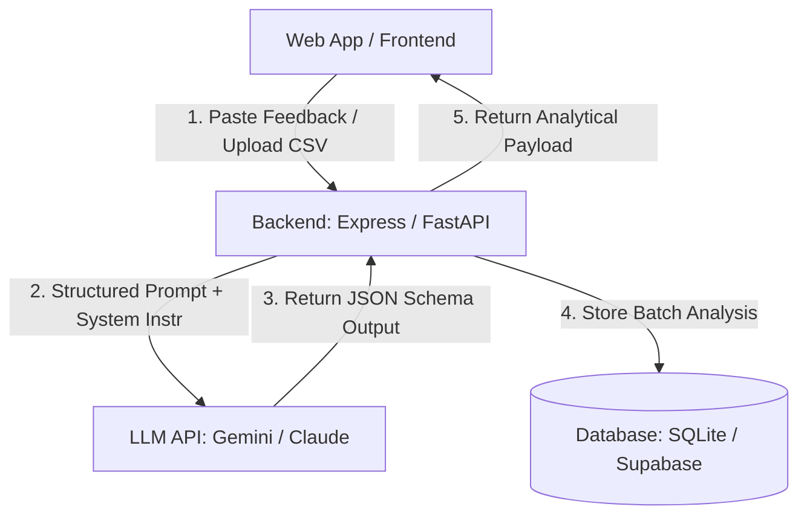

# Blueprints: Product Feedback Analyzer

This is a premium, ready-to-code frontend template for a **Product Feedback Analyzer**. The interface is pre-built with CSS styling and interactive JS simulations, so you can focus on writing the AI agent logic and database storage.

## Recommended Architecture



---

## 🛠️ Step-by-Step Implementation Guide

Follow these steps using Antigravity / Claude Code to build out the backend:

### 1. Initialize Server & Dependencies
Initialize a Node.js or Python backend. For example, using Python & FastAPI:
```bash
pip install fastapi uvicorn pydantic google-genai
```

### 2. Configure JSON Output Schema
Define the structured schema using Pydantic (Python) or Zod (JavaScript) so the LLM returns exact structured JSON instead of plain text:
```python
from pydantic import BaseModel
from typing import List

class FeedbackAnalysis(BaseModel):
    positive_pct: int
    neutral_pct: int
    negative_pct: int
    pain_points: List[str]
    feature_requests: List[str]
    executive_summary: str
```

### 3. Connect the LLM API
Create a `/analyze` endpoint that runs the model:
```python
from google import genai
from google.genai import types

client = genai.Client()

@app.post("/analyze")
async def analyze_feedback(text: str):
    response = client.models.generate_content(
        model='gemini-2.5-flash',
        contents=f"Analyze the following feedback and return structured metrics:\n{text}",
        config=types.GenerateContentConfig(
            response_mime_type="application/json",
            response_schema=FeedbackAnalysis,
            system_instruction="You are an expert product manager. Extract actionable bug reports and feature requests."
        ),
    )
    return response.text
```

### 4. Database Storage
Store the historical summaries in a database (e.g. SQLite / PostgreSQL) so teams can track sentiment trends over time.

---

## 🚀 How to Run locally
Simply open `index.html` in your browser, or spin up a local development server:
```bash
npx live-server .
```
