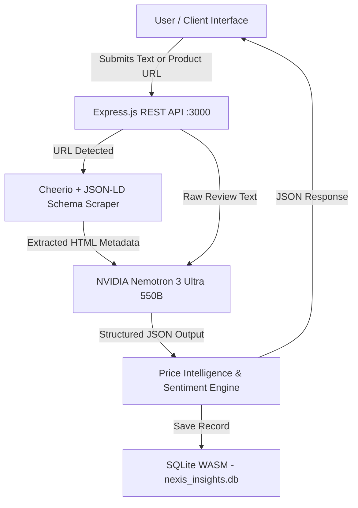

# 🔮 Nexis Insights — Universal Product Feedback & Price Intelligence Engine

[](https://02productfeedbackanalyzer.vercel.app)


-003B57?style=for-the-badge&logo=sqlite)


> 🚀 **Live Production Demo:** **[https://02productfeedbackanalyzer.vercel.app](https://02productfeedbackanalyzer.vercel.app)**
>
> **Nexis Insights** is a production-grade, real-world AI engine that extracts sentiment, key pain points, feature requests, and category-matched price intelligence from customer reviews or live e-commerce product URLs.
>
> 💎 **Enterprise & Premium Roadmap Note:** As user adoption and market demand increase, advanced Enterprise subscription tiers, custom multi-tenant packages, and dedicated SLA API keys will be released.

---

## 🌟 Key Features

- **🌐 Live Real-Time Web Scraper:** Automatically detects e-commerce URLs, extracts JSON-LD Schema.org product metadata (`price`, `currency`, `title`), and feeds clean page context to the AI.
- **🤖 Universal Multi-Category Price Engine:** Automatically detects product category and matches real-world competitor stores without cross-category errors.
- **🛡️ WASM SQLite Persistence & JWT Auth:** Zero-config embedded SQLite database (`nexis_insights.db`) with user registration, login, and report history storage.
- **📊 Interactive Price Trend Analytics:** 6-month historical price trend charts rendered using Chart.js.
- **📑 Analysis History & CSV Export:** Save, manage, filter, and export feedback reports into Excel/CSV format with a single click.

---

## 🏬 Universal Multi-Category Retailer Support

| Product Category | Supported Retailers & Competitor Outlets |
|------------------|-------------------------------------------|
| **PC Hardware (CPUs, GPUs, RAM)** | Amazon, MDComputers, Vedant Computers, PrimeABGB, Flipkart |
| **Fashion & Apparel** | Myntra, Ajio, Tata CLiQ, Amazon Fashion, Flipkart |
| **Smartphones & Mobile** | Amazon, Flipkart, Croma, Reliance Digital, Vijay Sales |
| **Beauty & Cosmetics** | Nykaa, Purplle, Tira, Amazon Beauty |
| **Home Appliances & Audio** | Croma, Reliance Digital, Amazon, Flipkart, Vijay Sales |
| **SaaS & Digital Products** | Official Site, AppSumo, G2 Deals, ProductHunt |

---

## 🏗️ System Architecture



---

## 🚀 Quick Start & Installation

### 1. Clone Repository
```bash
git clone https://github.com/voidreformer/nexis-insights.git
cd nexis-insights
```

### 2. Install Dependencies
```bash
npm install
```

### 3. Environment Variables
Copy `.env.example` to `.env` and provide your API keys:
```env
PORT=3000
OMNIROUTE_API_KEY=your_nvidia_nim_or_openrouter_api_key
OMNIROUTE_GATEWAY_URL=https://integrate.api.nvidia.com/v1
MODEL_NAME=nvidia/nemotron-3-ultra-550b-a55b
JWT_SECRET=your_jwt_secret_here
```

### 4. Run Server
```bash
npm start
```
Open **`http://localhost:3000`** in your browser!

---

## 📄 License
Distributed under the MIT License. Built with ❤️ for real-world problem solving.